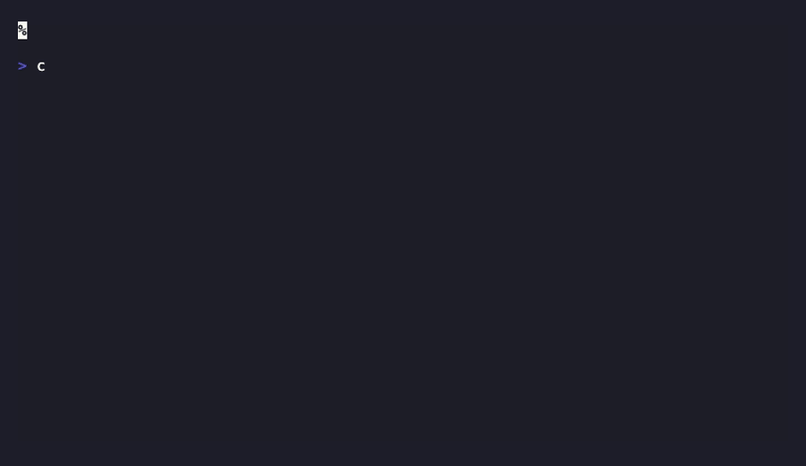
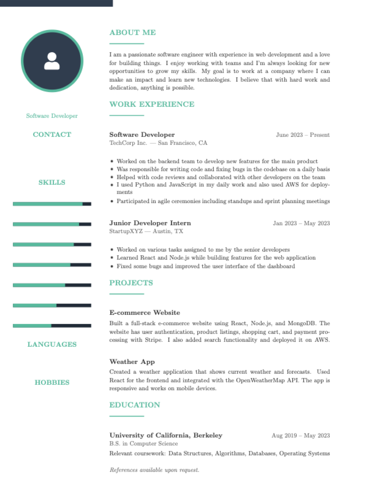

<p align="center">
  
</p>

<p align="center">
  
</p>

<p align="center">
  <a href="https://readme-typing-svg.demolab.com"></a>
</p>

<p align="center">
  <a href="#quick-start">Quick Start</a>
  &middot;
  <a href="#what-happens-when-you-run-it">How It Works</a>
  &middot;
  <a href="#llm-providers">Providers</a>
  &middot;
  <a href="#the-8-calibrcv-laws">The 8 Laws</a>
</p>

<p align="center">
  <a href="https://opensource.org/licenses/MIT"></a>
  <a href="https://nodejs.org/en/">= 18"></a>
  <a href="https://ollama.com"></a>
  <a href="https://www.npmjs.com/package/calibrcv"></a>
  <a href="https://www.npmjs.com/package/calibrcv"></a>
</p>

<p align="center">
  
</p>

---

**calibrcv** is an open-source CLI resume builder and ATS optimizer. It takes your resume PDF, rewrites it using AI under strict editorial rules, compiles it to LaTeX, and enforces a single-page limit through an agentic trim loop. Runs fully offline with Ollama. No account, no cloud, no data leaves your machine unless you choose a cloud provider.

> Most resume tools slap a template on your content and call it optimized. calibrcv runs a 9-stage pipeline with an actual scoring engine. It rewrites every bullet, enforces action verbs, kills filler, compiles to LaTeX, and loops until the result fits on one page. Then it scores the output against 5 ATS categories so you know exactly where you stand.

## Quick Start

```bash
npm install -g calibrcv

# pull a local model (free, runs on your machine)
ollama pull llama3.1

# optimize your resume
calibrcv build resume.pdf
```

That's it. Three commands. You get back a PDF, a `.tex` source file, and a terminal score report.

Just want a score? `calibrcv score resume.pdf` runs instantly, no AI needed.

## What Happens When You Run It

```
resume.pdf
    |
    v
 1. Parse PDF .............. extract text (or use VLM for image-based PDFs)
    |
    v
 2. Analyze ................ LLM diagnoses weaknesses, generates 3-7 questions
    |
    v
 3. Enrichment Interview ... you answer in the terminal (skippable)
    |
    v
 4. Synthesize ............. LLM rewrites every section under the 8 Laws
    |
    v
 5. Generate LaTeX ......... fills the sb2nov/resume template
    |
    v
 6. Compile + Trim Loop .... compiles to PDF; if >1 page, AI trims
    |    ^                   and recompiles (up to 6 rounds)
    |    |___________________|
    v
 7. ATS Score .............. pure algorithmic, 100-point scale
    |
    v
 optimized.pdf + resume.tex + score report
```

## Usage

### Build (full pipeline)

```bash
# basic
calibrcv build resume.pdf

# custom output path
calibrcv build resume.pdf -o optimized.pdf

# target a sector
calibrcv build resume.pdf --sector banking

# tailor for a specific job posting
calibrcv build resume.pdf --job-url https://linkedin.com/jobs/view/123456

# tailor from a job description file
calibrcv build resume.pdf --job-desc posting.txt

# paste job description inline
calibrcv build resume.pdf --job-desc "Senior engineer role requiring Python, AWS..."

# auto-detect URL in --job-desc
calibrcv build resume.pdf --job-desc https://linkedin.com/jobs/view/123456

# use a specific cloud provider
calibrcv build resume.pdf --provider openai

# use any model with any provider
calibrcv build resume.pdf --provider anthropic --model claude-sonnet-4-20250514
calibrcv build resume.pdf --provider openai --model gpt-4o
calibrcv build resume.pdf --provider groq --model llama-3.3-70b-versatile

# use a different Ollama model
calibrcv build resume.pdf --model mistral

# skip the enrichment Q&A
calibrcv build resume.pdf --skip-enrich

# use VLM (vision model) for PDF extraction
calibrcv build resume.pdf --vlm

# use a specific vision model with Ollama
calibrcv build resume.pdf --vlm --vlm-model qwen2-vl
```

### Score (no AI needed)

Just want to know where your resume stands? The scoring engine is pure algorithmic: it uses a smart heuristic parser to detect sections, extract bullets, and identify contact info. No LLM calls, runs instantly.

```bash
# basic score
calibrcv score resume.pdf

# score against a job description file
calibrcv score resume.pdf --job-desc posting.txt

# score against a live job posting
calibrcv score resume.pdf --job-url "https://linkedin.com/jobs/view/123456"

# score with inline job description text
calibrcv score resume.pdf --job-desc "Looking for a backend engineer with Python, Go..."
```

## LLM Providers

calibrcv tries providers in order and falls back automatically. Ollama is always first.

| Provider | Default Model | How to enable |
|----------|---------------|---------------|
| **Ollama** (default) | `llama3.1:8b` | `ollama serve` + `ollama pull llama3.1` |
| Groq | `llama-3.3-70b` | Set `GROQ_API_KEY` |
| Google Gemini | `gemini-2.5-flash` | Set `GEMINI_API_KEY` |
| OpenRouter | `llama-3.1-8b` (free tier) | Set `OPENROUTER_API_KEY` |
| OpenAI | `gpt-4o-mini` | Set `OPENAI_API_KEY` |
| Anthropic | `claude-sonnet-4` | Set `ANTHROPIC_API_KEY` |

The `--model` flag works with any provider:

```bash
calibrcv build resume.pdf --provider openai --model gpt-4o
calibrcv build resume.pdf --provider anthropic --model claude-sonnet-4-20250514
calibrcv build resume.pdf --provider groq --model llama-3.3-70b-versatile
```

Put your keys in `.env` in your working directory or at `~/.calibrcv/.env`:

```bash
GROQ_API_KEY=gsk_...
GEMINI_API_KEY=AI...
OPENROUTER_API_KEY=sk-or-...
OPENAI_API_KEY=sk-...
ANTHROPIC_API_KEY=sk-ant-...
OLLAMA_MODEL=llama3.1
VLM_MODEL=qwen2-vl
```

Force a specific provider: `calibrcv build resume.pdf --provider groq`

<details>
<summary><strong>VLM-Based PDF Parsing</strong> (click to expand)</summary>

By default, calibrcv extracts text from PDFs using `pdf-parse`. For scanned or image-based PDFs (where text extraction returns little to nothing), calibrcv can use a **Vision Language Model (VLM)** to read the PDF as an image.

```bash
# explicitly use VLM extraction
calibrcv build resume.pdf --vlm

# auto-fallback: if pdf-parse detects an image-based PDF, VLM kicks in automatically
calibrcv build resume.pdf
```

**VLM provider waterfall:** OpenAI GPT-4o -> Anthropic Claude -> Gemini Flash -> Ollama qwen2-vl

| Provider | Model | How to enable | Speed |
|----------|-------|---------------|-------|
| **OpenAI** | `gpt-4o` | Set `OPENAI_API_KEY` | Fast |
| **Anthropic** | `claude-sonnet-4` | Set `ANTHROPIC_API_KEY` | Fast |
| **Google Gemini** | `gemini-2.5-flash` | Set `GEMINI_API_KEY` | Fast |
| **Ollama** (local) | `qwen2-vl` | `ollama pull qwen2-vl` | Slower, fully offline |

**Recommended Ollama vision models:**

| Model | Size | Best for |
|-------|------|----------|
| `qwen2-vl` | 4.4 GB | Best quality, default choice |
| `llava:13b` | 8 GB | Strong alternative |
| `bakllava` | 4.7 GB | Faster, good quality |
| `llava` | 4.7 GB | Lightweight option |

</details>

## The 8 CalibrCV Laws

Every resume produced by calibrcv follows these rules. No exceptions, no overrides.

| # | Law | What it means |
|---|-----|---------------|
| 1 | **100-Character Bullets** | Every bullet fits in 100 characters. Period. |
| 2 | **HBS Action Verbs** | Every bullet opens with an approved verb (Architected, Deployed, Engineered...) |
| 3 | **Harvard-Style Summary** | 3-4 sentences, zero pronouns (no I/my/me/we), executive voice |
| 4 | **Realistic Grounding** | No inflated claims. Seniority-appropriate language only. |
| 5 | **Zero Em Dashes** | Replaced with semicolons, colons, or restructured sentences |
| 6 | **Two-Line Skills** | Exactly two rows: "Quantitative Stack" and "Analytic Domain" |
| 7 | **Strict Bullet Counts** | Experience: 2-3 bullets. Projects: exactly 2. |
| 8 | **Abbreviated Dates** | "Jun. 2023" format throughout |

<details>
<summary><strong>ATS Scoring Breakdown</strong> (click to expand)</summary>

The scoring engine is pure math. No AI calls, no external API. Five categories, 100 points.

| Category | Points | What it checks |
|----------|--------|---------------|
| Structural Integrity | 0-20 | Required sections present, dates on all entries |
| Keyword Density | 0-30 | TF-IDF matching against job description with stopword filtering and stem matching (or lexical richness without JD) |
| Content Quality | 0-25 | HBS verb compliance, quantified metrics, bullet length |
| Parsability | 0-15 | Box-drawing chars, em dashes, smart quotes, encoding issues |
| Completeness | 0-10 | Email, phone, LinkedIn, location, skills breadth |

</details>

## Before & After

<table>
<tr>
<td align="center"><strong>Before</strong></td>
<td align="center"><strong>After (CalibrCV)</strong></td>
</tr>
<tr>
<td></td>
<td></td>
</tr>
</table>


<details>
<summary>Want the LaTeX source?</summary>

- [`example_before.tex`](assets/example_before.tex): Colorful template resume (sidebar, skill bars, profile photo)
- [`example_after.tex`](assets/example_after.tex): CalibrCV output (clean, quantified, ATS-optimized)

Compile them yourself: `pdflatex assets/example_after.tex`
</details>

## Prerequisites

- **Node.js 18+**
- **Ollama** for local LLM (or a cloud API key from the table above)
- **LaTeX compiler** for PDF output: `tectonic`, `pdflatex`, or `xelatex`
  - macOS: `brew install tectonic` or `brew install --cask mactex`
  - Ubuntu/Debian: `sudo apt install texlive-full`
  - Windows: [MiKTeX](https://miktex.org/download)
  - If no compiler is found, calibrcv still outputs the `.tex` source file

## Why This Exists

**Everyone deserves a great resume.**

I applied to hundreds of internships as an undergrad. Wrote cover letters at 2am, tweaked margins to squeeze in one more bullet, and still got ghosted by ATS systems that never showed my resume to a human.

Career tools that actually work are locked behind paywalls, premium tiers, and monthly subscriptions. The people who need them most, students, career changers, people breaking into tech, are the ones least able to pay.

CalibrCV is the answer: a professional-grade resume pipeline you can install in 10 seconds and run offline. The AI logic, the prompts, the scoring engine, the LaTeX template: all open source. No account, no cloud, no paywall.

The job market is rough enough. Your resume format should not be the thing that stops you.

<div align="center">
<br />
<em>"The challenge of life, I have found, is to build a resume that doesn't<br />
simply tell a story about what you want to be, but it's a story about who you want to be."</em>
<br /><br />
<strong>&mdash; Oprah Winfrey</strong>
<br /><br />
</div>

## Contributing

PRs welcome. If you want to add a new LLM provider, the interface is simple: look at `src/providers/ollama.js` (55 lines) as a reference.

```bash
git clone https://github.com/Coflazo/calibrcv-cli.git
cd calibrcv-cli
npm install
node bin/calibrcv.js --help
```

## Acknowledgments

This project stands on the shoulders of generous tools and teams:

<p align="center">
  <a href="https://fal.ai"></a>
  &nbsp;&nbsp;&nbsp;
  <a href="https://azerion.ai"></a>
</p>

<p align="center">
  <em>Grateful to <a href="https://fal.ai">fal.ai</a> and <a href="https://azerion.ai">azerion.ai</a> for the infrastructure and support that helped bring this project to life.</em>
</p>

- [**Jake's Resume**](https://github.com/sb2nov/resume): The LaTeX template that powers every CalibrCV output
- [**Ollama**](https://ollama.com): Making local LLMs accessible to everyone

## License

[MIT](LICENSE)

<p align="center">
  
</p>
